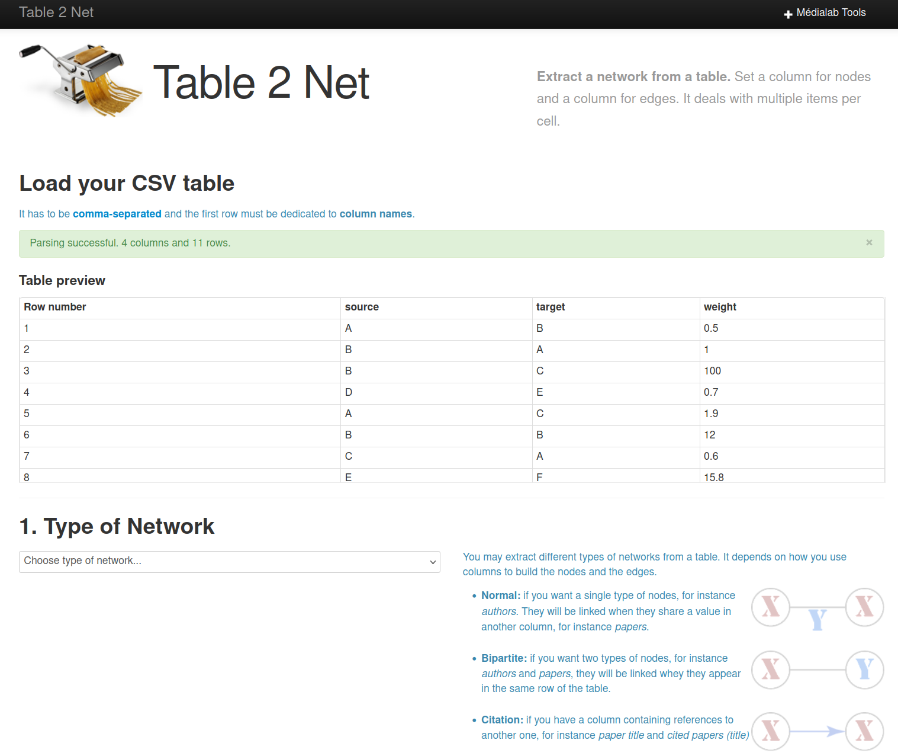
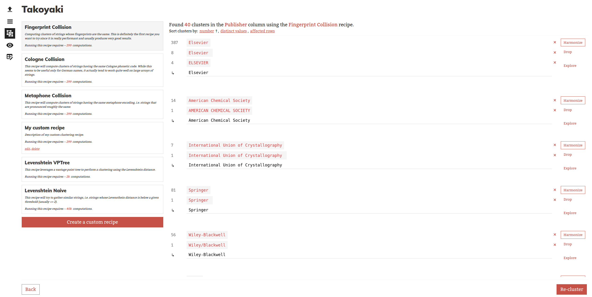
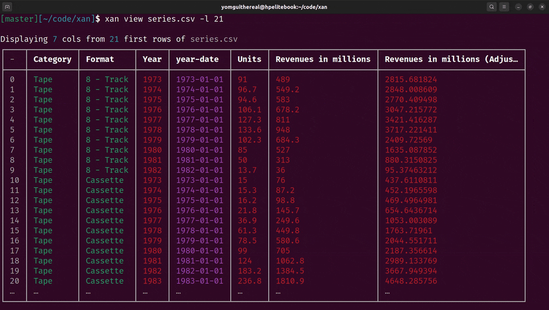

The médialab
===

The `médialab` is a social sciences research lab gathering:

- Researchers
- Engineers
- Designers

---

We have been building **Open-Source** tools geared towards social sciences & civil society at large for 10 years now!

Check out: [https://github.com/medialab/](https://github.com/medialab/)

<!-- end_slide -->

A CSV-shaped question
===

# Most of our tools/research use some kind of CSV data

We love CSV so much we wrote a ♥Love Letter♥ !

https://github.com/medialab/xan/blob/master/docs/LOVE_LETTER.md

---

# Why though?

Because CSV is an affordable, understandable and free data format.

So much so that CSV is a data `lingua franca` for our research engineering work.

<!-- end_slide -->

Affordances of tabular data (1/2)
===

Everybody is familiar with tabular data, at least through spreadsheets:

<!-- new_line -->
<!-- alignment: center -->

| name      | surname | age |
| --------- | ------- | --- |
| Guillaume | Plique  | 35  |
| Lucy      | Miller  | 37  |
| Marina    | Spring  | 45  |

<!-- new_line -->
<!-- alignment: left -->

<!-- end_slide -->

Affordances of tabular data (2/2)
===

Less so with nested or hierarchical data structures like the ones found in JSON:

```json
{
  "people": [
    {
      "name": "Guillaume",
      "surname": "Plique",
      "age": 35,
      "friends": ["lucy", "marina"]
    }
  ]
}
```

<!-- speaker_note: You can ask anybody to produce/edit tabular data. The same cannot be said of hierarchical data.  -->

<!-- end_slide -->

CSV is simple
===

The specification holds in the title: **C**omma **S**eparates **V**alues!

*(Everyone here knows it's a lie, sure you need to quote values with newlines and double your quotes, but you see the point...)*

---

In any case: it can be explained to anybody in mere **minutes**.

---

Even more so: the format is so simple you might invent it **yourself**.

*(Or should I say **discover** it)*

<!-- end_slide -->

CSV is free (1/2)
===

**Nobody** owns the CSV format.

It is and will always be a free and open collective idea.

It is so free it has **no real specification** either.

*(Don't force me to rant about RFC 4180, pretty please)*

---

It is so free some disciplines have their own CSV **dialects**:

- bioinformatics: `.vcf`, `.gff`, `.gtf` etc.
- web archives: `.cdx` etc.

<!-- end_slide -->

CSV is free (2/2)
===

You don't need **proprietary** software to process/read/write CSV data.

---

As a cheeky counterpoint, let's open an Excel file:

> vim data.xls

```txt
ÐÏ^Qࡱ^Zá^@^@^@^@^@^@^@^@^@^@^@^@^@^@^@^@;^@^C^@þÿ     ^@^F^@^@^@^@^@^@^@^@^@^@^@^A^@^@^@^H^@^@^@^@^@^@^@^@^P^@^@^B^@^@^@^A^@^@^@þÿÿÿ^@^@^@^@^@^@^@^@ÿÿÿÿÿÿÿÿÿÿÿÿÿÿÿÿÿÿÿÿÿÿÿÿÿÿÿÿÿÿÿÿÿÿÿÿÿÿÿÿÿÿÿÿÿÿÿÿÿÿÿÿÿÿÿÿÿÿÿÿÿÿÿÿÿÿÿÿÿÿÿÿÿÿÿÿÿÿÿÿÿÿÿÿÿÿÿÿÿÿÿÿÿÿÿÿÿÿÿÿÿÿÿÿÿÿÿÿÿÿÿÿÿÿÿÿÿÿÿÿÿÿÿÿÿÿÿÿÿÿÿÿÿÿÿÿÿÿÿÿÿÿÿÿÿÿÿÿÿÿÿÿÿÿÿÿÿÿÿÿÿÿÿÿÿÿÿÿÿÿÿÿÿÿÿÿÿÿÿÿÿÿÿÿÿÿÿÿÿÿÿÿÿÿÿÿÿÿÿÿÿÿÿÿÿÿÿÿÿÿÿÿÿÿÿÿÿÿÿÿÿÿÿÿÿÿÿÿÿÿÿÿÿÿÿÿÿÿÿÿÿÿÿÿÿÿÿÿÿÿÿÿÿÿÿÿÿÿÿÿÿÿÿÿÿÿÿÿÿÿÿÿÿÿÿÿÿÿÿÿÿÿÿÿÿÿÿÿÿÿÿÿÿÿÿÿÿÿÿÿÿÿÿÿÿÿÿÿÿÿÿÿÿÿÿÿÿÿÿÿÿÿÿÿÿÿÿÿÿÿÿÿÿÿÿÿÿÿÿÿÿÿÿÿÿÿÿÿÿÿÿÿÿÿÿÿÿÿÿÿÿÿÿÿÿÿÿÿÿÿÿÿÿÿÿÿÿÿÿÿÿÿÿÿÿÿÿÿÿÿÿÿÿÿÿÿÿÿÿÿÿÿÿÿÿÿÿÿÿÿÿÿÿÿÿÿÿÿÿÿÿÿÿÿÿÿÿÿÿÿÿÿýÿÿÿÿÿÿÿþÿÿÿ^D^@^@^@^E^@^@^@^F^@^@^@^G^@^@^@þÿÿÿ  ^@^@^@þ
~
```

<!-- end_slide -->

CSV is just text
===

You can **write** it yourself, to some degree.

You can **read** it yourself, to some degree.

If I hand out some CSV to you, you should be able to understand what's going on very easily in this piece of text.

And you will probably still be able to do so it in 50 years.

<!-- end_slide -->

CSV is a bridge
===

CSV can be handled by both **researchers**, **students** and **engineers** alike.

CSV is a bridge between the **spreasheet** world and the **engineering** world.

CSV is a good fit for both **tiny** & **big** data problem.

CSV creates the perfect conditions for the *de facto* auto-organized **interoperability** of a lot of free tools designed and maintained by many people around the world!

<!-- end_slide -->

An ethos of sobriety
===

Altough not exactly a chosen one ;)

---

* We don't have access to powerful hardware.
* Most of our users (students, researchers, civil society) don't have access to powerful hardware neither.

---

What makes CSV a *sober* data format?

<!-- end_slide -->

CSV is naturally succinct
===

1. Headers are only written once
2. Strings are optimally represented (except for quotes)
3. Numbers could be lighter, but not by much

<!-- end_slide -->

CSV is efficient
===

Can you reliably collect billions of tweets without databases, relying only on gigabytes of CSV data?

Sure! *(At least this is what we did for years before the evil dude arrived)*

CSV can be thought of as a structured append-only log format.

<!-- end_slide -->

Building tools around CSV (1/5)
===

# Dedicated web UIs



<!-- end_slide -->

Building tools around CSV (2/5)
===

# Dedicated web UIs



<!-- end_slide -->

Building tools around CSV (3/5)
===

# Command line tools

https://github.com/medialab/minet


CSV in, CSV out

<!-- end_slide -->

Building tools around CSV (4/5)
===

# Command line tools

https://github.com/medialab/xan



<!-- end_slide -->

Building tools around CSV (5/5)
===

# Libraries

https://github.com/medialab/casanova

```python
import casanova

with open("cities.csv") as input_file \
     open("enriched-cities.csv") as output_file:

  enricher = casanova.enricher(
    input_file, output_file,
    add=["pop_ratio"]
  )

  for row in enricher:
    ...
```

<!-- end_slide -->

CSV rewards out-of-the-box engineering
===

# Reading CSV data in reverse

Thanks to backslash-free quote escaping!

```bash
# Constant memory!
# Amortized linear time!
xan reverse file.csv
xan tail file.csv
```

# Resuming

Thanks to reverse reading!

```bash
minet fetch url -i posts.csv --resume -o report.csv
```
<!-- end_slide -->

Conclusion: always bet on CSV!
===


<!-- end_slide -->

Thank you for your time !
===

Some CSV-relevant links:

* `médialab's Open Source`: https://github.com/medialab/
* `Love Letter`: https://github.com/medialab/xan/blob/master/docs/LOVE_LETTER.md
* `xan`: https://github.com/medialab/xan
* `minet`: https://github.com/medialab/minet
* `casanova`: https://github.com/medialab/casanova
* `table2net`: https://medialab.github.io/table2net/
* `takoyaki`: https://yomguithereal.github.io/takoyaki/
* `pelote`: https://github.com/medialab/pelote/